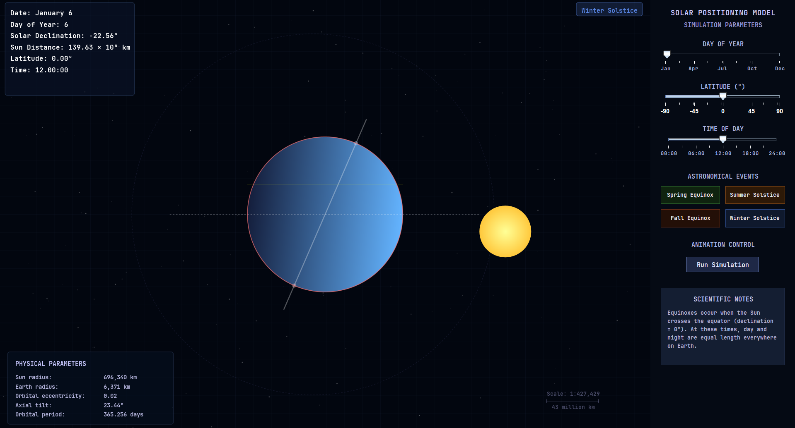

# 🌞 Solar Positioning Simulation

[](https://www.java.com)
[](LICENSE)
[]()
[]()

A Java-based interactive simulation that visualizes the position of the sun relative to Earth at different times of the year, latitudes, and times of day.

## 📸 Screenshots



## 🎥 Demo Video


## ✨ Features

- **Interactive Solar Position Visualization**
  - Real-time sun position calculation
  - Adjustable parameters (day, latitude, time)
  - Smooth animation controls

- **Astronomical Events**
  - Spring Equinox
  - Summer Solstice
  - Fall Equinox
  - Winter Solstice

- **Educational Information**
  - Scientific notes
  - Astronomical concepts
  - Real-time updates

## 🛠️ Installation

1. **Prerequisites**
   ```bash
   - Java 17 or higher
   - Git (optional)
   ```

2. **Clone the Repository**
   ```bash
   git clone https://github.com/yourusername/solar-positioning-simulation.git
   cd solar-positioning-simulation
   ```

3. **Build and Run**
   ```bash
   # Compile
   javac src/*.java
   
   # Run
   java -cp src MainFrame
   ```

## 📁 Project Structure

```
solar-positioning-simulation/
├── src/
│   ├── MainFrame.java
│   ├── SimulationPanel.java
│   ├── ControlPanel.java
│   ├── ControlPanelSetup.java
│   ├── InfoPanel.java
│   ├── CustomSlider.java
│   └── SpecialDayButton.java
├── image.png
├── video.mp4
└── README.md
```

## 🧩 Components

### MainFrame
- Main application window
- Component coordination
- Layout management

### SimulationPanel
- Solar position calculations
- 2D visualization
- Real-time updates

### ControlPanel
- User interface controls
- Parameter adjustment
- Animation management

### ControlPanelSetup
- UI component initialization
- Event handling setup
- Layout configuration

### InfoPanel
- Scientific information display
- Concept explanations
- State updates

### CustomSlider
- Parameter control
- Range-specific labels
- Smooth interaction

### SpecialDayButton
- Astronomical event selection
- Quick state updates
- Event-specific styling

## 🔧 Usage

1. **Adjust Parameters**
   - Use sliders to modify:
     - Day of year
     - Latitude
     - Time of day

2. **Special Events**
   - Click buttons for:
     - Spring Equinox
     - Summer Solstice
     - Fall Equinox
     - Winter Solstice

3. **Animation Control**
   - Start/Stop simulation
   - Adjust animation speed
   - Observe special events

## 📊 Technical Details

### Solar Position Calculation
```java
// Example calculation
double declination = calculateDeclination(dayOfYear);
double hourAngle = calculateHourAngle(timeOfDay);
double elevation = calculateElevation(declination, hourAngle, latitude);
```

### Animation System
```java
// Animation timer setup
Timer animationTimer = new Timer(50, e -> {
    updateSimulation();
    repaint();
});
```

## 🤝 Contributing

1. Fork the repository
2. Create your feature branch (`git checkout -b feature/AmazingFeature`)
3. Commit your changes (`git commit -m 'Add some AmazingFeature'`)
4. Push to the branch (`git push origin feature/AmazingFeature`)
5. Open a Pull Request

## 📝 License

This project is licensed under the MIT License - see the [LICENSE](LICENSE) file for details.

## 🙏 Acknowledgments

- Astronomical calculations based on standard formulas
- UI design inspired by modern scientific applications
- Special thanks to contributors and testers

## 📧 Contact

Your Name - [@yourtwitter](https://twitter.com/yourtwitter) - email@example.com

Project Link: [https://github.com/yourusername/solar-positioning-simulation](https://github.com/yourusername/solar-positioning-simulation) 
